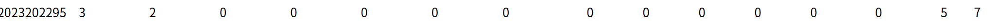

# bomblab 报告

姓名：李佳祎

学号：2023202295

| 总分 | phase_1 | phase_2 | phase_3 | phase_4 | phase_5 | phase_6 | secret_phase |
| --------- | ------------- | ------------- | ------------- | ----------------- |-----------|-----------|-----------|
| 7        | 1            | 1            | 1            | 1 |1  |1  |1  |

scoreboard 截图：

<!-- TODO: 用一个scoreboard的截图，本地图片，放到 imgs 文件夹下，不要用这个 github，pandoc 解析可能有问题 -->

## 解题报告

见pdf
> 实在抱歉，因为我个人感觉 纸笔 > word > markdown 所以重要的解题过程体现在了word随记（已经转为pdf）与插图照片中
> 为避免重复，markdown中只写pdf中不涉及的部分 

## 反馈/收获/感悟/总结

花费巨量时间 还是挺有意思的 就是感觉secret_phase难度太逆天了，想不到的想到天荒地老都看不出来

具体感想见pdf

## 参考的重要资料

无
